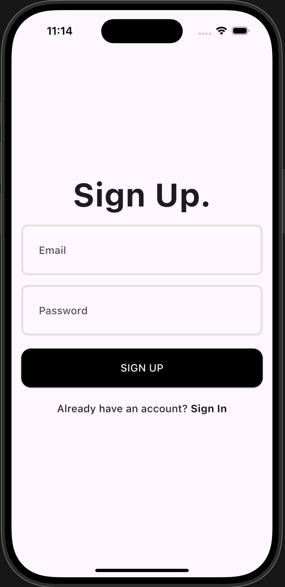
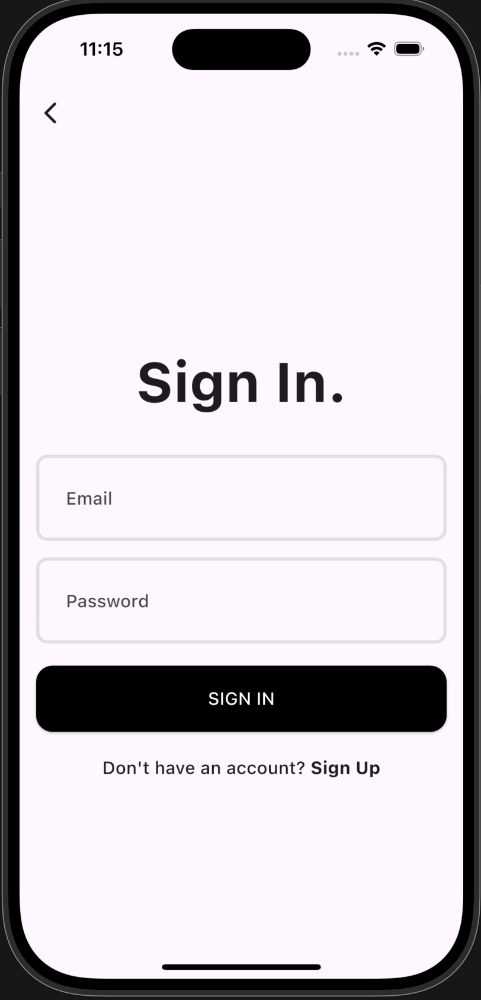
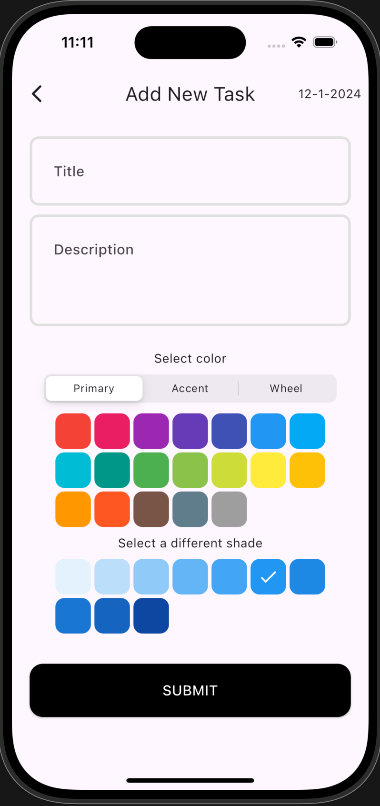

# **Authenticator App**

A cloud-based **Authenticator App** built with **Flutter** and **Firebase** for secure user authentication and real-time syncing across devices.

You can directly download it from the above `app_release_apk` file.

## **Features**

- **User Authentication**: Secure sign-up and login using Firebase Authentication.
- **Multi-Factor Authentication (MFA)**: Supports multiple verification methods such as SMS, email-based verification, and more.
- **Real-Time Sync**: Instant session updates and data synchronization across multiple devices using Firebase Firestore.
- **Cross-Platform**: Fully functional on both **Android** and **iOS** platforms.

## **Tech Stack**

- **Frontend**: **Flutter**, **Dart**
- **Backend**: **Firebase** (Authentication, Firestore)
- **Tools**: **Android Studio**, **FlutterFire**

## **Setup**

1. Clone the repository:

   ```bash
   git clone https://github.com/your-username/authenticator-app.git
   cd authenticator-app
2.	Install dependencies:
    `flutter pub get`
3.	Run the app:
   `flutter run`
  	
## **App Screenshots**

Here are some screenshots of the app:

1. **Signup Screen:**

   

2. **Login Screen:**

   

3. **Home Screen:**

   

4. **Add Task Page:**

   


